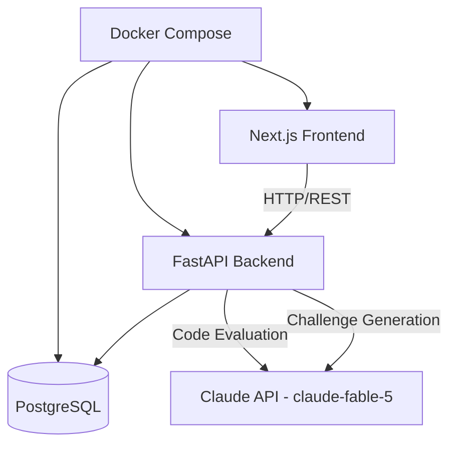
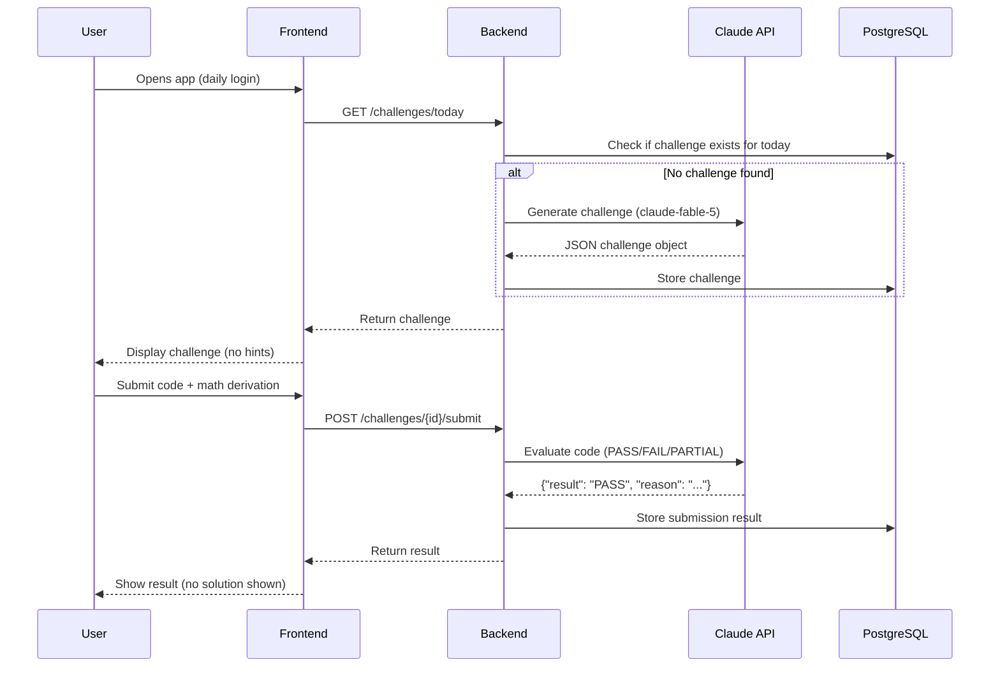
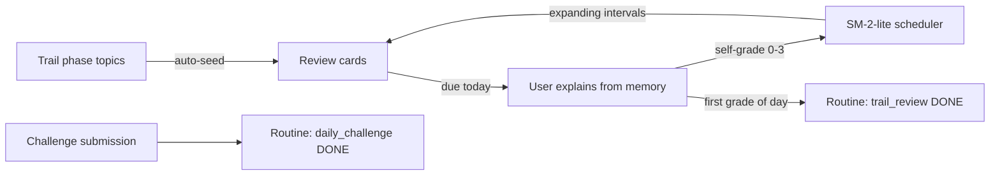

# Architecture

Disciplina is a three-service system: a Next.js frontend, a FastAPI backend, and PostgreSQL. The Anthropic Claude API (`claude-fable-5`) is used minimally — once per day for challenge generation, and once per submission for code evaluation.

## System Overview

## Daily Challenge Flow

## Backend Layers

| Layer | Location | Responsibility |
|---|---|---|
| API endpoints | `backend/app/api/v1/endpoints/` | Request/response handling, auth dependency |
| Services | `backend/app/services/` | Claude integration, trail progression rules |
| Models | `backend/app/models/` | SQLAlchemy ORM models |
| Schemas | `backend/app/schemas/` | Pydantic request/response validation |
| Core | `backend/app/core/` | Settings, JWT, password hashing |
| DB | `backend/app/db/` | Session, Alembic migrations, seeding |

## Claude API Constraints

- Model: `claude-fable-5`, called via the official `anthropic` Python SDK.
- Generation: max 800 tokens. Evaluation: max 100 tokens.
- Sampling parameters (`temperature`, `top_p`, `top_k`) are **not sent** — the
  Fable 5 API rejects them with a 400 error.
- Strict system prompts force JSON-only responses; the backend parses
  defensively (`_extract_json`) and validates required keys.
- On any API failure, generation falls back to the pre-seeded
  `fallback_challenges` pool; evaluation falls back to a `PENDING` result.
- Challenges are cached in the database per user+date — one generation call
  per day, never regenerated.

## Learning Dynamic

The app implements evidence-based study techniques — spaced repetition (SM-2-lite), active recall, Feynman explanations, and Pomodoro focus blocks. Full rationale, references, and the scheduling algorithm: [learning-method.md](learning-method.md).

Key tables: `review_cards` (one per user+phase+topic, unique constraint). Services: `review_service.py` (scheduler + seeding), `routine_service.py` (cross-feature auto-logging).

## Enforcement Rules (server-side)

1. Evaluation returns only PASS/FAIL/PARTIAL + one sentence. No solutions.
2. Routine items are logged permanently; re-logging the same item returns 409.
3. "Wake up before 7:00 AM" checked after 7:00 AM server time is stored as `LATE`.
4. Trail phases must be completed in order; out-of-order completion returns 409.
5. Submissions with `math_derivation` under 50 characters return 422.
6. One challenge per user per day, enforced by a unique constraint on (user_id, date).
