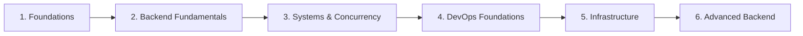

# Learning Trail — Backend + DevOps

Linear, no skipping. Each phase requires: study the topics, type the exercises by hand, and submit a written summary (minimum 100 characters) to complete the phase. The API rejects out-of-order completion.

## Phase 1 — Foundations (Weeks 1–3)
**Topics:** HTTP, TCP/IP, DNS, how servers work, processes, file descriptors
**Exercises:**
- Build a raw TCP echo server in C
- Implement an HTTP/1.1 GET parser in Python

## Phase 2 — Backend Fundamentals (Weeks 4–7)
**Topics:** REST design, SQL, indexes, transactions, auth (JWT, sessions), hashing
**Exercises:**
- Build a REST API from scratch in FastAPI
- Write raw SQL migrations

## Phase 3 — Systems & Concurrency (Weeks 8–11)
**Topics:** Threads, async I/O, connection pooling, caching (Redis), message queues
**Exercises:**
- Implement a job queue
- Benchmark a slow query and fix it

## Phase 4 — DevOps Foundations (Weeks 12–16)
**Topics:** Docker, Docker Compose, Linux basics, environment variables, CI/CD concepts
**Exercises:**
- Containerize an app
- Write a Dockerfile from scratch
- Set up a GitHub Actions pipeline

## Phase 5 — Infrastructure (Weeks 17–22)
**Topics:** VPS, SSH, Nginx, reverse proxy, SSL/TLS, monitoring (Prometheus basics)
**Exercises:**
- Deploy an app to a VPS manually
- Configure Nginx
- Set up basic monitoring

## Phase 6 — Advanced Backend (Weeks 23–28)
**Topics:** Microservices tradeoffs, event-driven architecture, system design basics
**Exercises:**
- Design and document a system
- Implement one service with a message queue

## Rules

- The trail also drives daily challenge difficulty: phases 1–2 → beginner, 3–4 → intermediate, 5–6 → advanced.
- Completing a phase requires a **Feynman explanation** (min 100 characters): explain what you learned as if teaching a beginner. If you cannot explain it simply, you have not understood it.
- Every topic of every phase you reach becomes a **spaced-repetition review card** automatically — the trail feeds the review deck. See [learning-method.md](learning-method.md).
- No tutorials are provided. Topic names only. Find primary sources.
